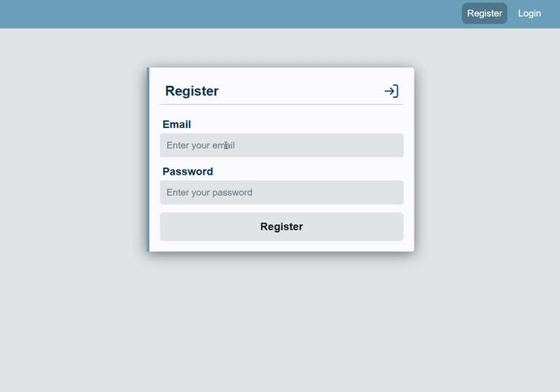
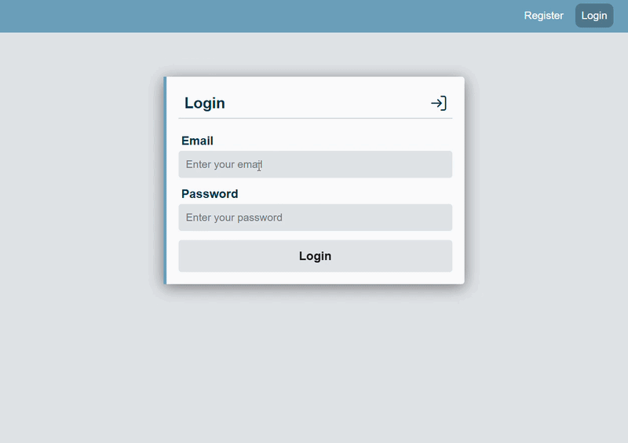
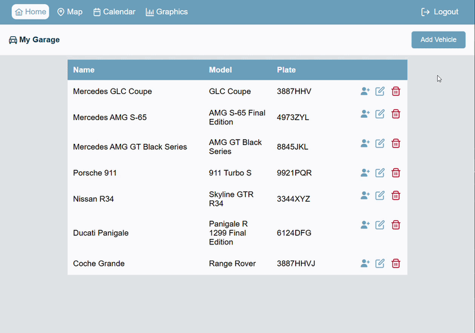
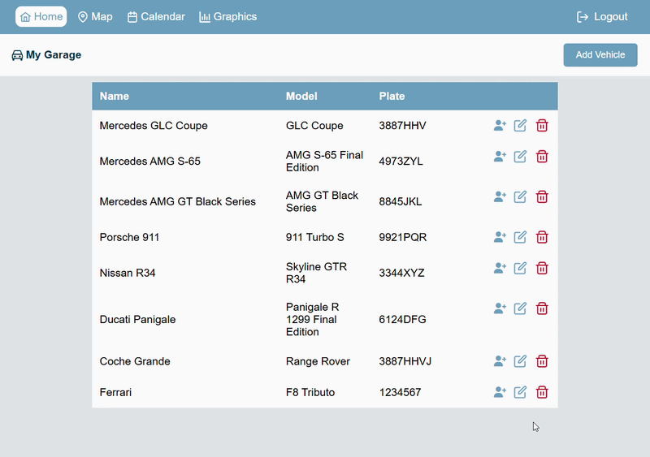
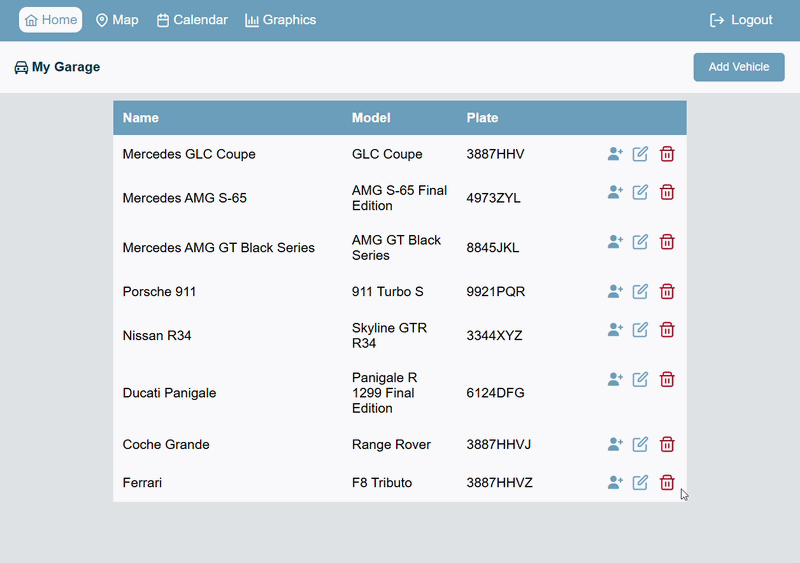
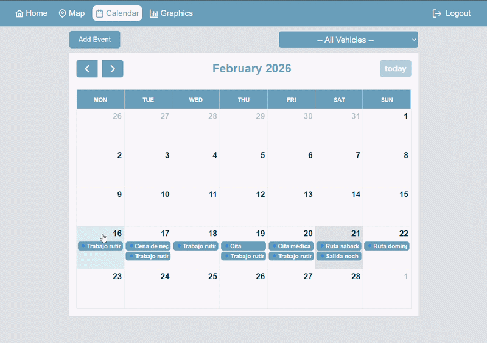
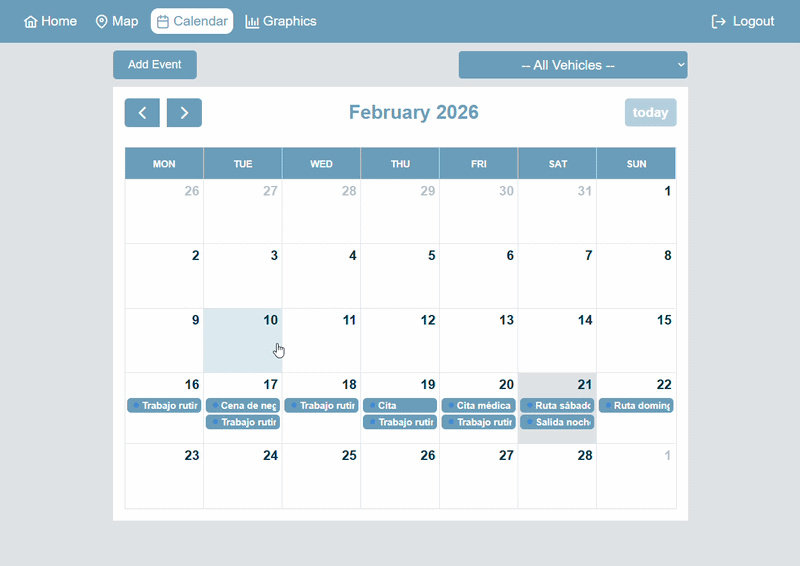
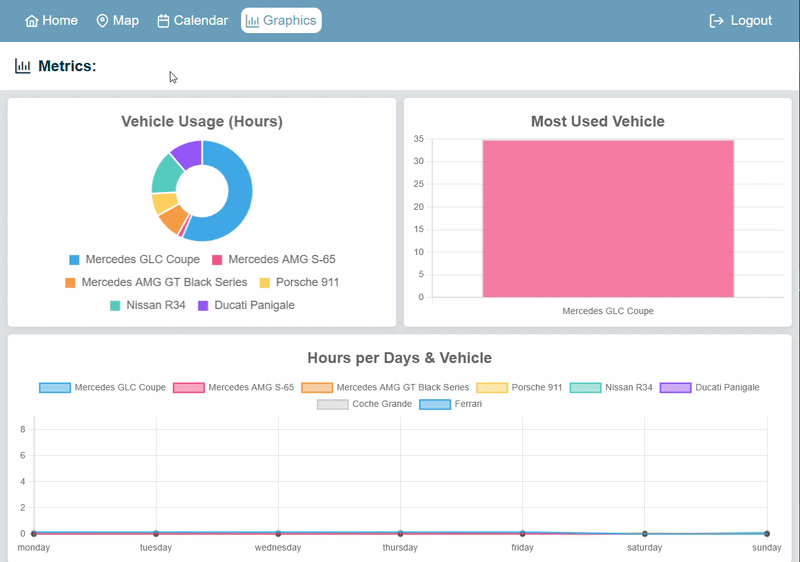

# WhereIsMyCar app


## Index

- [Descripción de la Aplicación](#descripción-de-la-aplicación)
- [Tecnologías](#tecnologías)
- [Estructura del Proyecto](#estructura-del-proyecto)
- [Instalación del Proyecto](#instalación-del-proyecto)
- [Uso](#uso)
- [Vista Previa del Proyecto](#vista-previa-del-proyecto)
- [Tests](#tests)
- [Contribución](#Contribución)
- [GH-Pages](#gh-pages)
- [Autor](#autor)

---

## Descripción de la Aplicación:

Este proyecto consiste en una aplicación desarrollada con Angular 20 orientada a la gestión personalizada de un garaje de vehículos. La aplicación permite a cada usuario administrar sus propios coches, registrar su ubicación, planificar su uso mediante un calendario y visualizar estadísticas detalladas de utilización.

La aplicación está estructurada en módulos y componentes reutilizables, e integra autenticación de usuarios, protección de rutas mediante Guards, consumo de APIs, gestión de estado, formularios reactivos con validaciones y persistencia de datos en base de datos.

La funcionalidad principal se organiza en diferentes bloques:
- **Autenticación de usuarios:** Registro y login mediante email y contraseña. Cada usuario dispone de su propio perfil y datos independientes.
- **Gestión de vehículos (CRUD):** Creación, edición y eliminación de coches dentro del garaje personal.
- **Gestión de ubicación en mapa:** Visualización de los vehículos en un mapa interactivo donde es posible actualizar su posición mediante drag & drop para indicar dónde se han aparcado.
- **Calendario de eventos:** Planificación de eventos asociados a cada coche con fecha y hora específicas.
- **Control de solapamientos:** El sistema impide la creación de eventos que coincidan en horario para el mismo vehículo.
- **Filtrado dinámico:** Posibilidad de visualizar eventos de un coche concreto o de todos los vehículos.
- **Gestión de eventos (CRUD):** Creación, edición y eliminación de eventos desde el calendario.
- **Sistema de comentarios:** Los usuarios pueden añadir comentarios en los eventos registrados.

- Panel de estadísticas: Visualización de gráficos que muestran:
    - Total de horas acumuladas por coche.
    - Vehículo más utilizado.
    - Distribución de horas de uso por día de la semana.

La aplicación combina gestión de datos, visualización geográfica, planificación temporal y análisis estadístico dentro de una única plataforma integrada.

## Tecnologías

- `HTML5`
- `CSS3`
- `JavaScript`
- `TypeScript`
- `Angular 20`
- Angular Dependencys: `PrimeNG`, `Leaflet`, `FullCalendar`, `Chart.js`
- Backend: `NestJS`, `MongoDB`
- Autenticación:`Firebase Authentication`
- Testing: `Jasmine`

---

## Estructura del Proyecto

```bash
src/
 ├─ app/
 │   ├─ features/
 │   │   ├─ auth/ ( login, register, services )
 │   │   ├─ calendar/ ( components, modals, services, interfaces )
 │   │   ├─ graphics/ ( components, services, interfaces )
 │   │   ├─ map/ ( components, services )
 │   │   └─ vehicle/ ( components, modals, services, interfaces )
 │   ├─ pages/ ( home, map, calendar, graphics )
 │   └─ shared/ ( components, layout, services )
 ├─ assets/
 ├─ environments/
 ├─ index.html
 ├─ main.ts
 └─ styles.css
```

---

## Instalación del Proyecto

La aplicación está dividida en dos repositorios:
- Frontend → Angular 20 https://github.com/JordiMiravet/WhereIsMyCarApp.git
- Backend → NestJS https://github.com/JordiMiravet/WhereIsMyCarApp-backend.git

Es necesario levantar ambos para que funcione correctamente.

#### Requisitos previos

- Node.js v20 o superior
- Angular CLI (`npm install -g @angular/cli`)
- MongoDB en ejecución

#### 1. Frontend

Clonar el repositorio:

```bash
    git clone https://github.com/JordiMiravet/WhereIsMyCarApp.git
    cd whereismycarapp
    npm install
```
Configuración de Firebase Authentication:

- Configurar Firebase Authentication:
    - Crear proyecto en Firebase Console
    - Activar Email/Password Authentication
    - Añadir aplicación web y copiar configuración
    - Crear src/environments/environment.ts con tu configuración

Dentro de src, crear la carpeta environments y añadir el archivo:

```bash
    src/environments/environment.ts
```

Con el siguiente contenido, reemplazando los valores por los de tu proyecto:

```typescript
    export const environment = {
        production: true,
        firebaseConfig: {
            apiKey: "TU_API_KEY",
            authDomain: "TU_AUTH_DOMAIN",
            projectId: "TU_PROJECT_ID",
            storageBucket: "TU_STORAGE_BUCKET",
            messagingSenderId: "TU_MESSAGING_SENDER_ID",
            appId: "TU_APP_ID"
        }
    };

```

#### 2. Backend

Clonar el repositorio del backend:
```bash
    git clone https://github.com/JordiMiravet/WhereIsMyCarApp-backend.git
    cd whereismycar-backend
    npm install
```

Crear un archivo .env en la raíz del proyecto con el siguiente contenido:

```env
    PORT=3000
    MONGO_URI=mongodb://localhost:27017/whereismycar

    FIREBASE_PROJECT_ID=tu_project_id
    FIREBASE_CLIENT_EMAIL=tu_client_email
    FIREBASE_PRIVATE_KEY=tu_private_key
```

Las credenciales de Firebase se obtienen desde:
Firebase Console → Configuración del Proyecto → Cuentas de servicio → Generar nueva clave privada.
Del archivo JSON descargado necesitas:
- project_id
- client_email
- private_key

La private_key debe mantenerse en una sola línea y conservar los \n.

#### 3. Ejecutar la aplicación

Primero levantar el backend:

```code
    npm run start:dev
```

Después, en otra terminal en el proyecto de frontend, levantar el frontend:

```bash
    ng serve
```

Abrir en el navegador:

```bash
    http://localhost:4200
```


Notas
- Es necesario tener Node.js instalado.
- Angular CLI debe estar instalado globalmente:
```bash
    npm install -g @angular/cli
```
- Las claves reales no están incluidas en el repositorio.
- Cada desarrollador debe usar su propio proyecto de Firebase.

---

## Uso

Aquí explicas cómo interactuar con la app una vez que está corriendo. Por ejemplo:

    1. Abrir la aplicación en el navegador: http://localhost:4200
    2. Registrar un nuevo usuario con email y contraseña.
    3. Iniciar sesión con tus credenciales.
    4. Crear, editar o eliminar un vehículo desde el panel de gestión de vehículos (Home).
    5. Mover coches en el mapa para actualizar su ubicación. (Map)
        - Por defecto se muestran todos los coches.
        - Filtrando un vehículo concreto, solo se mostrará la localización de ese coche.
    6. Añadir, editar o eliminar eventos al calendario para cada coche. (Calendar)
        - La app evita conflictos de horario entre eventos de un mismo coche.
        - Por defecto se muestran los eventos de todos los vehículos.
        - Filtrando un vehículo concreto, solo se verán los eventos de ese coche.
    7. Visualizar estadísticas en la sección de gráficos. (Graphics)

---

## Vista Previa del Proyecto

A continuación se muestra una vista previa de la aplicación en funcionamiento:

#### Registro de usuario

#### Login de usuario

#### Gestión de vehículos (CRUD)



#### Mapa interactivo (drag & drop y filtrado por coches)

#### Calendario de eventos (CRUD, control de solapamientos y filtrado de eventos)




#### Panel de estadísticas (gráficos)


---

## Tests

La aplicación incluye tests unitarios desarrollados con Jasmine, ejecutables mediante Angular CLI:

```bash
    ng test
```
- Componentes y servicios principales testeados:
    - Componentes: `VehicleTableComponent`, `CalendarViewComponent`, `MapViewComponent`, `GraphicsViewComponent`
    - Servicios: `VehicleService`, `CalendarService`, `MapService`, `GraphicsService`
- Cobertura:

```markdown
| Tipo       | Total | Cobertura |
| ---------- | ----- | --------- |
| Statements | 501   | 79.64%    |
| Branches   | 99    | 71.71%    |
| Functions  | 150   | 75.33%    |
| Lines      | 453   | 80.13%    |

Total Tests : 356
```

#### Ejemplo destacado y explicación por líneas

El siguiente test es uno de los más interesantes, ya que combina asincronía, manejo de errores y fallback logic dentro del método saveVehicle del MapComponent:

```typescript
it('should use fallback location when geolocation fails', async () => {

    // 1. Mock del vehículo que se va a guardar
    const vehicle = {
        name: 'Mercedes GLC Coupe',
        model: 'GLC Coupe',
        plate: '3447VHZ',
    };

    // 2. Establecemos el modo de modal en 'create'
    vehicleModalStateServiceMock.mode.set('create');

    // 3. Simulamos que la geolocalización falla
    geolocationServiceMock.getCurrentLocation.and.rejectWith(new Error('geolocation failed'));

    // 4. Reiniciamos los spies de addVehicles
    vehicleServiceMock.addVehicles.calls.reset();

    // 5. Llamamos a saveVehicle
    await component.saveVehicle(vehicle as any);

    // 6. Se espera que se haya intentado obtener la geolocalización
    expect(geolocationServiceMock.getCurrentLocation).toHaveBeenCalled();

    // 7. Se espera que el vehículo se haya añadido usando la ubicación fallback
    expect(vehicleServiceMock.addVehicles).toHaveBeenCalled();
    const addedVehicle = vehicleServiceMock.addVehicles.calls.mostRecent().args[0];
    expect(addedVehicle.location).toEqual({ lat: 41.478, lng: 2.310 });

    // 8. Se espera que se cierre el modal al finalizar
    expect(vehicleModalStateServiceMock.close).toHaveBeenCalled();
});
```

#### Ejemplo de test de template

Este test asegura que el mapa se renderiza correctamente cuando la lista de vehículos no está vacía:
```Typescript
it('should render map view when vehicle list is not empty', () => {
    vehicleServiceMock.vehicles.set([{
        name: 'Mercedes GLC Coupe',
        model: 'GLC Coupe',
        plate: '3447VHZ',
        location: { lat: 41.486, lng: 2.311 }
    }]);
    fixture.detectChanges();

    const mapView = fixture.nativeElement.querySelector('app-map-view');
    expect(mapView).toBeTruthy();
});
```

También se testean casos de estado vacío y apertura/cierre de modales para asegurar la correcta interacción del usuario con la interfaz.

---

## Contribución

Si quieres contribuir a este proyecto, puedes:

1. Hacer un fork de los repositorios. 
    - Frontend: https://github.com/JordiMiravet/WhereIsMyCarApp.git
    - Backend: https://github.com/JordiMiravet/WhereIsMyCarApp-backend.git
2. Crear una rama con la nueva funcionalidad o corrección de bug (`git checkout -b feature/nueva-funcionalidad`).
3. Hacer commits claros y descriptivos.
4. Hacer push a tu rama.
5. Crear un Pull Request describiendo tus cambios.

---

## GH-Pages

Actualmente, la aplicación no está desplegada en GitHub Pages. 

## Autor

[**Jordi Miravet**](https://www.linkedin.com/in/jordimiravet-dev/)